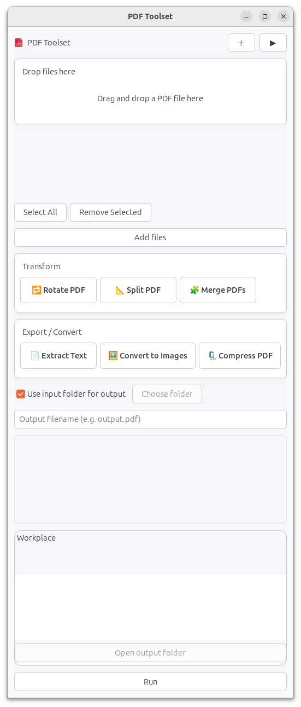

# PDF Toolset

[](https://github.com/JianquanWang/pdf-toolset/releases/latest)
[](https://github.com/JianquanWang/pdf-toolset/releases/latest)

A desktop application built with Rust and GTK4 for performing various PDF operations such as merging, splitting, rotating, extracting text, converting to images, and compressing PDFs. The app features a drag-and-drop interface for easy file handling.



## Features

- **Merge PDFs**: Combine multiple PDF files into one.
- **Split PDFs**: Split a PDF into individual pages, saved in a dedicated folder.
- **Rotate PDFs**: Rotate PDF pages (90° CW, 90° CCW, 180°) with optional page selection.
- **Extract Text**: Extract text content from PDFs and save to a text file.
- **Convert to Images**: Convert PDF pages to image files (PNG by default).
- **Compress PDFs**: Reduce PDF file size using image optimization.
- **Drag-and-Drop**: Easily add PDF files by dragging them into the app.
- **Progress Tracking**: Real-time progress bars for each file during operations.
- **Output Management**: Choose output folder and customize filenames.
- **Preview**: View the first page of the selected PDF with rotation preview.

## Installation

### Prerequisites

- **Operating System**: Ubuntu 24.04 (or compatible Linux distribution)
- **Rust Toolchain**: Install from [rustup.rs](https://rustup.rs)
- **GTK4 Development Libraries**:

```bash
sudo apt update
sudo apt install -y build-essential pkg-config libgtk-4-dev libglib2.0-dev
```

### Building from Source

1. Clone the repository:

```bash
git clone <repository-url>
cd pdf-tools
```

2. Build the project:

```bash
cargo build --release
```

The binary will be located at `target/release/pdf-tools`.

## Usage

1. **Launch the Application**:

```bash
cargo run
```

Or run the built binary:

```bash
./target/release/pdf-tools
```

2. **Add PDF Files**:
   - Drag and drop PDF files into the drop area, or use the "Add files" button to select files via a file dialog.
   - Files appear in the scrollable input pool with checkboxes for selection.

3. **Select an Operation**:
   - Choose from the function buttons: Merge, Split, Rotate, Extract Text, Convert to Images, or Compress.
   - For Split and Convert to Images, the output filename is automatically set to a folder name (e.g., `inputname-pages` or `inputname-images`).
   - For Rotate, select direction and optionally specify pages (e.g., "1-3,5").

4. **Configure Output**:
   - Check "Use input folder for output" or choose a custom folder.
   - Edit the output filename in the entry field.

5. **Run the Operation**:
   - Click the "Run" button (or the ▶ in the header).
   - Monitor progress in the workplace panel, which shows input files, progress bars, and output paths.
   - Once complete, use "Open output folder" to view results.

6. **Preview**:
   - The app automatically generates a preview of the first page.
   - For Rotate, the preview updates based on selected rotation.

### UI Overview

- **Header**: Quick access to Add files and Run operations.
- **Drop Area**: Drag PDFs here to add them.
- **File Pool**: Scrollable list of added files with checkboxes.
- **Function Buttons**: Grouped into Transform (Merge, Split, Rotate) and Export/Convert (Extract Text, Convert to Images, Compress).
- **Output Options**: Folder selection and filename editing.
- **Workplace**: Three-column list (Input | Progress | Output) showing per-file status.
- **Preview**: Thumbnail of the first page.

## Deployment

### For Development

- Use `cargo run` for quick testing.

### For Distribution

1. Build the release binary:

```bash
cargo build --release
```

2. **Packaging as .deb for Ubuntu** (for installation via apt and launch from Show Apps):

   Run the provided packaging script:

   ```bash
   ./package_deb.sh
   ```

   This script will:
   - Build the release binary
   - Create the .deb package structure with control file, desktop entry, and icon
   - Build the .deb file
   - Optionally install it locally

   The app will appear in Show Apps and can be launched directly.

3. Distribute as a standalone executable or via package managers.

### System Requirements

- GTK4 runtime libraries (installed via `sudo apt install libgtk-4-1`)
- Poppler utilities (`pdftoppm` for previews and image conversion)
- ImageMagick (`convert` for rotation previews)

Install additional tools if needed:

```bash
sudo apt install -y poppler-utils imagemagick
```

## Contributing

Contributions are welcome! Please submit issues or pull requests on the project repository.

## License

MIT License
